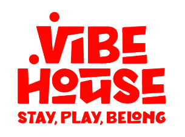
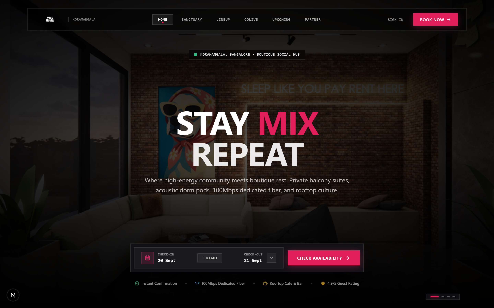
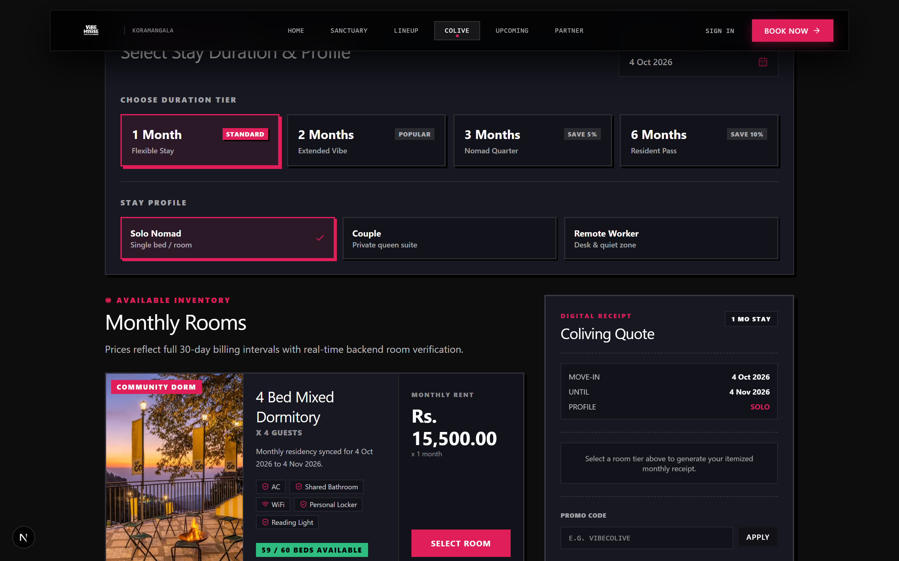
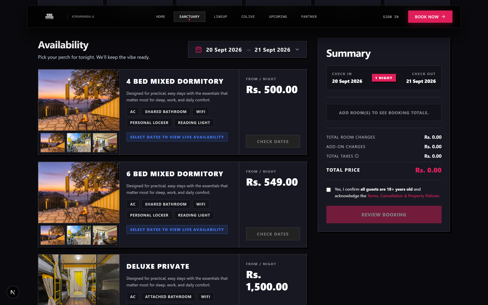
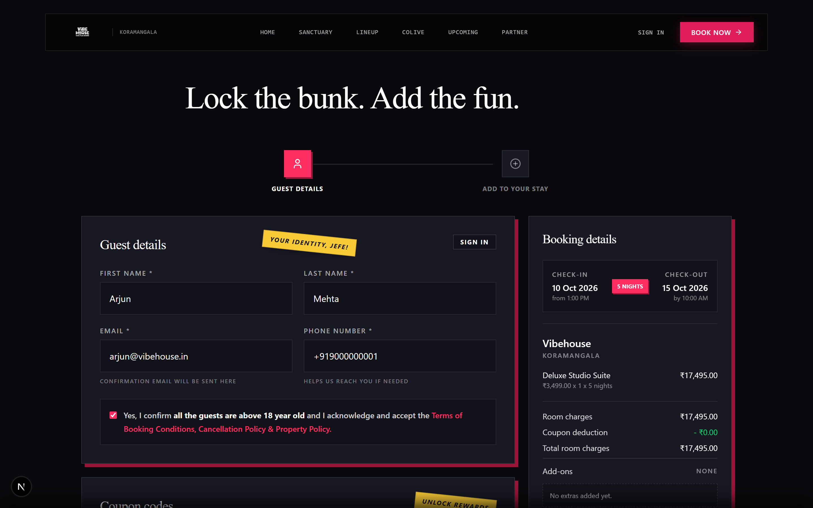
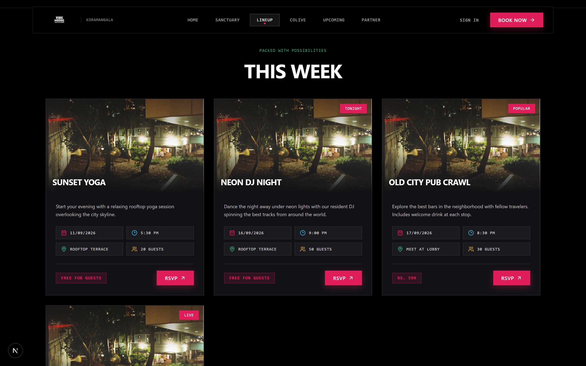
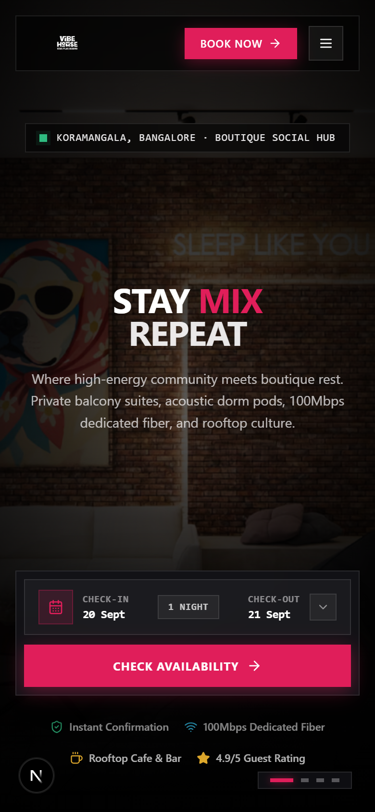
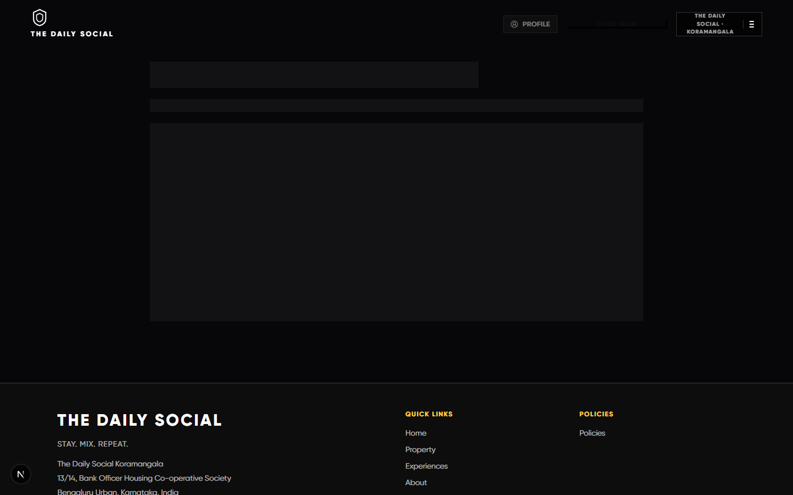
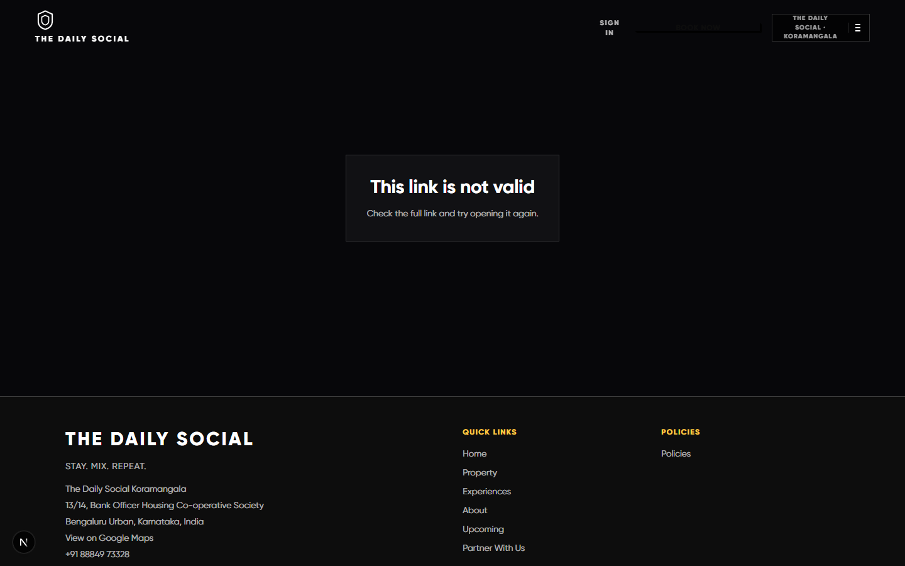
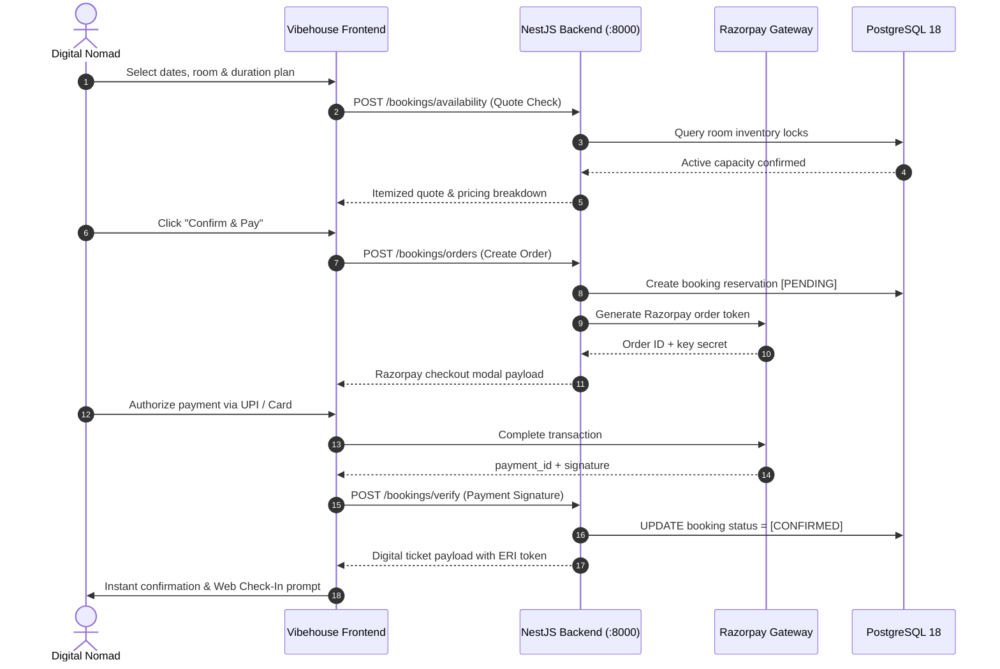

<div align="center">



# VIBEHOUSE

### High-Energy Coliving & Hostel Ecosystem. Neo-Brutalist Precision.

An expressive, dark-first digital hospitality platform where travelers, remote nomads, and creators book stays with visceral, tactile momentum.

[Explore The Experience](#the-guest-experience) &nbsp;&middot;&nbsp; [The Visual System](#designed-for-momentum) &nbsp;&middot;&nbsp; [Architecture & State Flow](#built-to-move) &nbsp;&middot;&nbsp; [Run Locally](#run-it-locally) &nbsp;&middot;&nbsp; [Roadmap & Attributions](#provenance--attributions)

<br/>

[](https://nextjs.org/)
[](https://react.dev/)
[](https://www.typescriptlang.org/)
[](https://turbo.build/)
[](https://tailwindcss.com/)
[](https://github.com/CRED-CLUB/neopop-web)
[](https://www.postgresql.org/)
[](https://nestjs.com/)

</div>

---

> *"Vibehouse is engineered around one physical feeling: booking a bunk, locking a 3-month coliving pass, or ordering morning breakfast should never feel like filling out a tax form. Every state transition feels immediate, physical, and unmistakably premium."*

---

<div align="center">



</div>

## The Guest Experience

Vibehouse merges modern hostel culture with high-precision digital product design. Across every screen, the interface adheres to a strict neo-brutalist geometry, pitch-black layered surfaces, and authentic CRED NeoPOP 3D plunk physics.

| Guest Move | What It Feels Like |
| :--- | :--- |
| **Discover** | Browse curated Bangalore properties (*The Daily Social*, *Buteak Suites*) with live bed inventories, high-contrast imagery, and neighborhood vibes. |
| **Configure** | Toggle between short-stay hostel bunks and 1, 2, 3, or 6-month coliving passes with instant dynamic pricing and real-time coupon calculation. |
| **Lock & Pay** | Check out with zero friction through a Razorpay payment order gateway backed by automated database reservation locks and webhook reconciliation. |
| **Web Check-In** | Skip the reception desk queue via a multi-guest digital KYC portal featuring local document cropping and instant OCR verification. |
| **Digital Ticket** | Receive an itemized digital boarding ticket with crisp receipt-style typography, live status badges, and WhatsApp pass sharing. |
| **In-House Living** | Order tokenized complimentary breakfasts (enforced by an 11:00 PM IST freeze window) and submit numeric CSAT feedback with zero friction. |

<br/>

<details>
<summary><strong>✨ What Works Today (Production-Ready Full-Stack Monorepo)</strong></summary>

- **NeoPOP Primitives Library (`components/neopop/`)**: Custom 3D plunk buttons (`NeoPopButton`) with 3px 45° bevels, tactile translation (`translate3d(2px, 2px, 0)`), selectable cards, status dots, and count badges.
- **Strict Zero-Radius Standard**: Complete monorepo-wide enforcement of `rounded-none` (`0px`) across all cards, dialogs, inputs, dropzones, and chips.
- **Editorial Typography Engine**: High-contrast **Geologica** display headlines paired with **Lexend** UI body copy, tabular currency formatting, and uppercase tracked utility kickers.
- **Coliving Duration Engine (`/colive`)**: Interactive 1-Month, 2-Month, 3-Month (5% off), and 6-Month (10% off) selection passes with live addon reconfiguration (Chef's meal plan, dedicated desk, laundry).
- **Guest Web Check-In & OCR (`/bookings/[eri]/web-check-in`)**: Multi-guest slot accordions, Gov. ID upload dropzone with client-side crop modal, and mock Textract OCR pipeline verification.
- **Digital Ticket Confirmation (`/bookings/[eri]/confirmed`)**: Razorpay-verified digital ticket with 6px offset shadows, cancellation milestone timeline, and one-tap receipt exports.
- **Complimentary Breakfast System (`/breakfast/[token]`)**: Tokenized guest room tabs, veg/non-veg dish counters, and live order confirmation modals.
- **Guest CSAT Rating Flow (`/feedback/[token]`)**: Tactile 1-to-5 numeric score plunk buttons, structured comment forms, and verified submission states.
- **Decoupled Backend Engine**: Local NestJS API running on port 8000 with PostgreSQL 18 (58 tables seeded), mock AWS S3 file storage, mock Textract OCR, and mock Zoho Desk ticketing.
- **Next.js 16.2.9 Turbopack Build**: 62/62 static and SSG routes prerendered cleanly with zero hydration defects and 100% type safety.

</details>

<details>
<summary><strong>🔭 What Is Intentionally Next</strong></summary>

- Automated WhatsApp notification webhooks with localized booking receipts.
- Direct Bluetooth Low Energy (BLE) mobile room keycard unlocking.
- Real-time resident chat channels and in-house community board websockets.
- Multi-currency international traveler checkout (USD / EUR / GBP) via Razorpay Cross-Border.

</details>

---

## Designed For Momentum

Vibehouse's visual system is a local React 19-compatible adaptation of the **CRED NeoPOP** design system. The interface uses an absolute `#0D0D0D` pitch-black canvas, sharp zero-radius geometry, 3px 45-degree beveled edges, directional offset shadows, and tactile 120ms press physics.

### 1. Coliving Duration Engine & Real-Time Receipt Quote
> Select between 1, 2, 3, or 6-month resident passes with live price calculation, dynamic addon configuration, and digital receipt breakdown.

<div align="center">



</div>

### 2. Curated Properties & Live Room Inventory
> Real-time backend room inventory, live bed capacity markers, and brutalist room specifications.

<div align="center">



</div>

### 3. High-Fidelity Booking Checkout Review
> Transparent cost schedules, instant coupon application, live guest verification, and Razorpay-ready payment summary.

<div align="center">



</div>

### 4. Community Events & Social Lineup Bento
> High-contrast event poster cards, neon status tokens, and tactile RSVP plunk triggers.

<div align="center">



</div>

### 5. Mobile Responsiveness & Zero-Radius Shell
> Touch-first booking search, compact NeoPOP action bar, and responsive navigation across all devices.

<div align="center">



</div>

### 6. Frictionless Web Check-In & Digital Boarding Ticket
> Multi-guest slot accordion, Gov. ID upload dropzone with mock OCR, and Razorpay-verified digital ticket with 6px offset shadows.

<div align="center">

| Multi-Guest Web Check-In & KYC | Razorpay Verified Digital Ticket |
| :---: | :---: |
|  |  |

</div>

<br/>

### Semantic Momentum Palette

| Product State | Hex Code | Visual & Psychological Role |
| :--- | :--- | :--- |
| **Affirmative / Next Move** | `#FFCB45` | Primary yellow plunk CTAs, active highlights, and immediate booking opportunities. |
| **Progress / Live** | `#3BFFAD` | Neon green confirming live room inventory, verified KYC status, and completed steps. |
| **Active Work / Focus** | `#3F6FD9` | Electric blue carrying keyboard focus outlines, room category chips, and active filters. |
| **Celebration** | `#FF426F` | Punchy pink reserved for milestone rewards, community event tags, and perks. |
| **Failure / Cancel** | `#EE4D37` | Affirmative red reserved for destructive actions, cancellation milestones, and validation errors. |
| **Structure / Edge** | `#3D3D3D` | Crisp hairlines framing cards, separators, and neutral count badges. |

### Typography Hierarchy

| Role | Primary Face | Fallback Stack | Application |
| :--- | :--- | :--- | :--- |
| **Editorial Display** | `Geologica` | -apple-system, BlinkMacSystemFont, "Segoe UI", sans-serif | High-contrast hero moments, section titles, and ticket headlines. |
| **Product Headings** | `Geologica` | Space Grotesk, system-ui, sans-serif | Subsection titles, dialog titles, and card headers. |
| **Body & UI Controls** | `Lexend` | Inter, -apple-system, sans-serif | Dense booking summaries, house guidelines, buttons, and inputs. |
| **Utility & Numbers** | Monospace Tabular | Space Grotesk, monospace | Room rates (₹), check-in countdowns, dates, and promo codes. |

---

## Built To Move

Vibehouse enforces strict transactional integrity across guest mutations. Every reservation, coliving quote, and payment lifecycle transition passes through an authenticated backend command boundary:



---

## Core Route Architecture

Vibehouse is built on Next.js 16.2.9 with the App Router, providing 62 statically compiled and dynamic SSG routes:

```
app/
├── (marketing)
│   ├── page.tsx                           # High-contrast hero & search showcase
│   ├── rooms/page.tsx                     # Live room catalog & filtering
│   ├── property/page.tsx                  # Deep-dive property amenities & neighborhood
│   ├── events/page.tsx                    # Community events calendar & RSVP board
│   └── colive/page.tsx                    # Coliving quote engine & duration tiers
├── booking/
│   ├── page.tsx                           # Interactive booking checkout flow
│   └── review/page.tsx                    # Booking review & addon selection
├── bookings/[eri]/
│   ├── confirmed/page.tsx                 # NeoPOP digital boarding ticket
│   └── web-check-in/page.tsx              # Multi-guest KYC dropzone & OCR portal
├── breakfast/[token]/
│   └── page.tsx                           # Complimentary breakfast ordering portal
├── feedback/[token]/
│   └── page.tsx                           # Tokenized CSAT 5-star rating flow
└── guest/                                 # In-house resident utility suite
    ├── addons/page.tsx                    # Extra towels, laundry, dedicated desk
    ├── borrow/page.tsx                    # Borrowable electronics & equipment
    ├── services/page.tsx                  # Room housekeeping & maintenance
    └── checkout/page.tsx                  # One-click express checkout
```

---

## Run It Locally

### 1. Prerequisites
- **Node.js**: `20.10.0+` (tested with Node 26.2)
- **PostgreSQL**: `18+` (running locally or in Docker)
- **Package Manager**: `npm`

### 2. Clone & Setup Frontend

```bash
# Clone the repository
git clone https://github.com/pankajverma2108/vibehouse-frontend.git
cd vibehouse-frontend

# Install dependencies
npm install

# Copy environment template
cp .env.example .env.local
```

### 3. Launch Development Services

```bash
# Recommended: Full-stack supervisor (boots PostgreSQL 18, NestJS backend, and Next.js frontend together)
npm run dev:all

# Or start only Next.js with Turbopack (runs on port 3005 if port 3000 is occupied)
npm run dev
```

Visit [http://localhost:3005](http://localhost:3005) (or `http://localhost:3000`) in your browser.

### 4. Build & Production Verification

```bash
# Validate TypeScript types monorepo-wide
node --max-old-space-size=4096 ./node_modules/typescript/bin/tsc --project tsconfig.json --noEmit

# Compile production bundle with Turbopack
npm run build

# Start the optimized production server
npm run start
```

---

## Project Quality Gates & Scripts

| Command | Action |
| :--- | :--- |
| `npm run typecheck` | Validates TypeScript types across all 62 routes and primitives without emitting code. |
| `npm run build` | Compiles an optimized standalone production build using Next.js 16 and Turbopack. |
| `npm run lint` | Enforces ESLint rules, accessibility guidelines, and import conventions. |
| `npm run test` | Executes unit and component tests with Vitest. |

---

## Provenance & Attributions

- **CRED NeoPOP Web**: Visual principles, 3D button plunk mechanics, and spatial elevation tokens adapted from [CRED NeoPOP Web](https://github.com/cred-club/neopop-web) under the [Apache License 2.0](https://www.apache.org/licenses/LICENSE-2.0). Upstream commit pinned at `1f4b3d271f3e041abb400cb25061217230192fed`. Full legal details in [`THIRD_PARTY_NOTICES.md`](THIRD_PARTY_NOTICES.md).
- **shadcn/ui & Radix UI**: Core accessible component foundations used under the [MIT License](https://github.com/shadcn-ui/ui/blob/main/LICENSE.md).
- **Photography**: Bangalore lifestyle and hostel interior photography from [Unsplash](https://unsplash.com) under the [Unsplash License](https://unsplash.com/license).

---

<div align="center">

Crafted with obsessive precision for travelers, digital nomads, and creators.<br/>
**Vibehouse &copy; 2026. All rights reserved.**

</div>