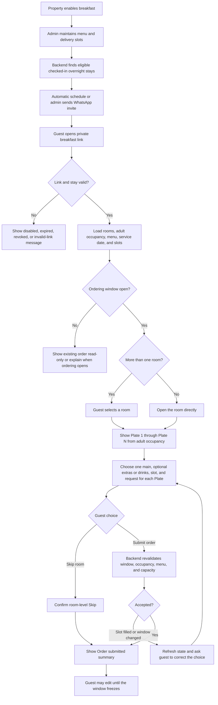

# Guest Breakfast Ordering - Stakeholder Walkthrough

**Audience:** property owners, operations stakeholders, and the author of the Breakfast BRD

**Scope:** the working guest journey and its current operating limits

## What the feature introduces

Checked-in guests can pre-order complimentary breakfast from a private WhatsApp link. The page uses the property's live breakfast menu, eligible room occupancy, delivery slots, and remaining slot capacity supplied by the backend.

One WhatsApp link covers every room attached to the same booker. For example, a guest who booked Rooms 201, 202, and 203 receives one link and can switch between those rooms on the breakfast page.

## How the guest receives the link

1. The property enables breakfast and maintains its menu and delivery slots in the admin breakfast console.
2. The backend identifies eligible bookings: checked-in guests who are staying overnight.
3. Breakfast links are sent through the configured WhatsApp/WATI invitation, either by the automatic schedule or the admin's manual send action.
4. Each invitation contains a private, stay-specific breakfast link.
5. The guest opens the link without signing in again.

## Guest webpage walkthrough

1. The backend validates that the link is active and that the stay is still eligible.
2. The page loads the guest's rooms, adult occupancy, service date, current menu, and available delivery slots.
3. If the booking contains several rooms, the guest selects a room from the room selector.
4. Each room starts with one Plate per eligible adult: Plate 1, Plate 2, and so on.
5. For every Plate, the guest:
   - selects one main dish;
   - optionally adds sides or beverages;
   - selects that Plate's delivery slot;
   - optionally adds an allergy or preparation note.
6. If fewer adults want breakfast, the guest can remove individual Plates.
7. The guest can explicitly skip breakfast for an entire room.
8. Selecting **Submit order** sends the complete choices for rooms that have Plates.
9. The backend checks the ordering window, room occupancy, menu IDs, and live slot capacity again.
10. A successful order opens an **Order submitted** confirmation with a room-by-room and Plate-by-Plate summary.
11. The guest may return and edit the order while the backend ordering window remains open.

## Workflow diagram

## What property operations can control

- Whether breakfast is enabled for the property.
- Which menu items are active, their category, description, vegetarian status, and display order.
- Which delivery slots are active and the Plate capacity of each slot.
- Automatic invitation timing and manual invitation sending.
- Admin placement or adjustment of an order for a guest when operational intervention is required.
- Daily room orders, Plate totals, slot occupancy, dashboard totals, and kitchen quantity summaries.

## Current limitations and rules

- Eligibility and Plate counts come from backend/PMS room occupancy. The webpage cannot override them.
- Plates are based on eligible adults; children do not create additional Plates in the current contract.
- Each Plate can select one main dish. Sides and beverages are optional.
- Slot capacity is counted in Plates, not rooms. Two Plates using one slot consume two places.
- A slot can become full between page load and Submit. The backend remains the final authority and may ask the guest to choose again.
- Skip applies to one room at a time. Rooms omitted from a submission remain unchanged.
- The link stops working after checkout, revocation, property breakfast disablement, or another backend terminal state.
- When the ordering window is frozen, the guest can view saved choices but cannot change them.
- Phase 1 manages a menu catalog, not ingredient inventory or per-item stock.
- Delivery-driver tracking, delivery SLA, buffet fallback, and post-delivery rating are not part of the current guest webpage.

## Source-of-truth rule

The backend is authoritative for the guest's rooms, adult occupancy, menu items, delivery slots, remaining capacity, link validity, ordering window, and saved order. The frontend only displays and submits the values permitted by that response.
