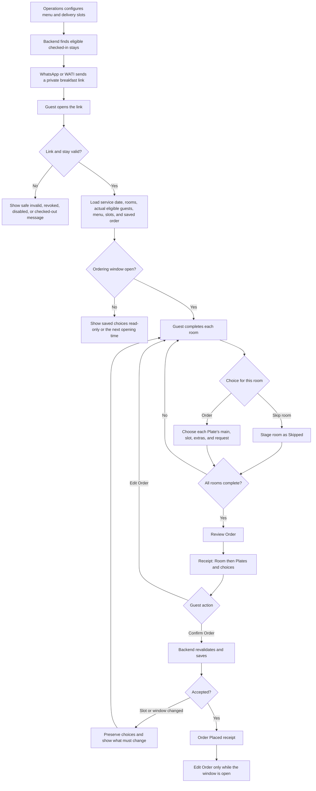

# Guest Breakfast Ordering - Stakeholder Walkthrough

**Audience:** property owners, operations stakeholders, and the Breakfast BRD owner

**Scope:** working guest flow and operational limitations

## What the feature does

Checked-in guests receive one private WhatsApp link for breakfast ordering. The link can include every room held by the same booker. The webpage shows the actual breakfast-eligible guest count for each room, the live menu, delivery slots, and saved choices supplied by the backend.

A room that can physically hold two people does not automatically receive two Plates. If only one eligible guest is recorded in that room, the backend returns one and the page shows only Plate 1.

## Guest walkthrough

1. Operations enables breakfast, maintains the menu and slots, and sends the invitation automatically or manually through the configured WhatsApp/WATI flow.
2. The guest opens the private link without another login.
3. The backend validates the link, stay, service date, and ordering window.
4. The page loads all rooms attached to the booking and the actual eligible guest count for each room.
5. For each room, the guest chooses either to order or to skip breakfast for that room.
6. For every Plate being ordered, the guest selects one main dish, an available delivery slot, optional extras or beverages, and an optional request.
7. The guest can remove a Plate when fewer listed guests want breakfast and can restore it only up to the backend count.
8. `Review Order` remains disabled until every room is complete or explicitly skipped. The page shows what still needs attention.
9. `Review Order` opens a receipt grouped by Room and Plate. No order has been sent yet.
10. `Edit Order` returns to the same choices. `Confirm Order` sends the reviewed receipt to the backend.
11. The backend rechecks the room, eligible guests, menu, window, and live slot capacity.
12. On success, the guest sees `Order Placed`. A saved order shows only `Edit Order` while changes are still allowed.

## Workflow diagram

## What operations controls

- Property breakfast enablement.
- Active menu items, categories, descriptions, vegetarian state, and order.
- Delivery slots and Plate capacity.
- Automatic invitation timing and manual invitation sending.
- Admin order placement or correction where operational intervention is needed.
- Daily orders, slot occupancy, Plate totals, and kitchen summaries.

## Current limitations

- The backend is the source of truth for rooms and actual breakfast-eligible guest count. The guest page cannot increase that count.
- Current backend documentation treats `max_plates` as eligible adults per room; it is not the room's physical maximum occupancy.
- Every ordered Plate needs one main and one slot. Sides and beverages are optional.
- Slot capacity is counted in Plates, not rooms. A slot may fill after the page loads, so the backend can require another choice.
- Skip applies separately to each room and is saved only when the guest confirms the complete reviewed order.
- The page becomes read-only when the backend freezes ordering and stops working after checkout, revocation, disablement, or invalidation.
- Menu and slot administration, ingredient stock, delivery tracking, buffet fallback, and ratings are outside this guest page.
- TDS is the current frontend production target. Buteak hosting is a later rollout and requires its own route acceptance.

## Source-of-truth rule

The frontend displays and submits only the backend response. It does not derive guest count from a room label, bed type, apartment capacity, or marketing inventory.
