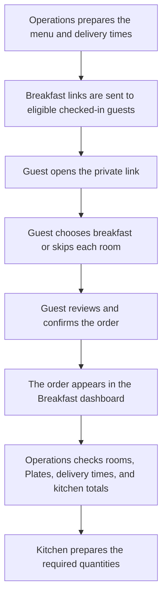

# Breakfast Operations Manual

**For:** property owners, managers, reception, housekeeping leads, and breakfast operations staff

**Property:** The Daily Social - Koramangala

This manual explains how the breakfast ordering service works from the guest's WhatsApp message to the kitchen preparation list.

## The full journey at a glance

## What the guest receives

An eligible checked-in guest receives a private WhatsApp message for the next morning's complimentary breakfast.

The approved message follows this format:

> Hello [Guest name], your complimentary breakfast can be pre-ordered for tomorrow.
>
> Room: [Room number]
>
> Tap below to view the menu, choose your dishes and pick a delivery slot. Orders and changes are open until 7:00 AM.

An **Order breakfast** button appears below the message. It opens the breakfast page on the correct property website, such as The Daily Social or Buteak.

Important:

- The link is private and belongs to that stay. Do not forward it to another guest.
- One link can show more than one room when the same guest has multiple rooms.
- If the ordering closing time is changed in the admin dashboard, the approved WhatsApp message must be updated to show the same time.

## What the guest does on the breakfast page

1. The guest taps **Order breakfast** in WhatsApp. No separate guest login is required.
2. The page shows the guest's room or rooms, the current breakfast menu, and the available delivery times.
3. The number of Plates shown for a room follows the actual guest count recorded for that room.
4. For each room, the guest chooses breakfast or selects **Skip Breakfast**.
5. For each Plate, the guest chooses one main dish and one delivery time.
6. The guest may also add available extras, drinks, and a special request.
7. The guest selects **Review Order** to see a receipt grouped by room and Plate.
8. **Edit Order** returns to the choices. **Confirm Order** sends the order.
9. After confirmation, the guest sees **Order Placed**. The guest may edit the order while ordering is still open.

The guest sees the delivery time, for example **07:30 - 08:00**. Internal names such as **Slot1** are not used as the guest-facing delivery time.

## Sign in to the admin dashboard

1. Open [Vibe House Admin](https://admin.thedailysocial.co.in/login).
2. Use the sign-in details supplied by an authorized property manager.
3. Select the **Owner / Director** role when using the owner account.
4. Select **The Daily Social - Koramangala** as the property.
5. Sign in.
6. Open [Breakfast Ordering](https://admin.thedailysocial.co.in/dashboard/breakfast).

Do not add shared passwords to this manual, WhatsApp groups, kitchen printouts, or other public documents.

## Before sending breakfast links

### Turn breakfast on or off

Use the breakfast switch at the top of the page.

- When breakfast is on, eligible guests can receive links and place orders.
- When breakfast is off, guests cannot order and automatic links are not sent.
- The menu and delivery times can still be prepared while breakfast is off.

Turn breakfast off only when the property is not serving breakfast. Confirm the decision with the property manager because it affects every eligible guest at that property.

### Check the ordering hours

The **Ordering window** controls when guests can place, change, or skip breakfast.

1. Check **Ordering opens at (IST)**.
2. Check **Ordering freezes at (IST)**.
3. Select **Save window** only when a time has been intentionally changed.
4. Make sure the opening and closing times are different.

The current WhatsApp wording says that orders and changes are open until **7:00 AM**. If the closing time changes, arrange for the WhatsApp wording to be changed as well.

### Check automatic link sending

The **Auto-send schedule** controls recurring breakfast invitations.

- Turn automatic sending on or off.
- Choose the sending time in IST.
- Choose how many hours should pass before the next send.
- **Next send** shows when the next automatic send is expected.
- **Last sent** shows the most recent automatic run.
- Select **Save schedule** after an intentional change.

Breakfast must be on for automatic sending to work.

### Send links immediately

Use **Send breakfast links** when the links need to be sent without waiting for the next scheduled run.

The system sends a private breakfast link to eligible guests who are checked in and staying for the breakfast morning. Avoid pressing the button repeatedly unless another send is intentionally required.

## Dashboard: the morning overview

Open the **Dashboard** tab and select the correct breakfast date.

The dashboard shows:

- **Rooms ordered:** number of rooms that placed breakfast orders.
- **Plates ordered:** total breakfasts the kitchen should prepare.
- **Skipped:** rooms that explicitly skipped breakfast.
- **Checked-in bookings:** checked-in room bookings considered for the selected date.
- **Participation:** percentage of checked-in rooms that placed an order.
- **Slot occupancy:** number of Plates assigned to each delivery time compared with its capacity.
- **Kitchen prep summary:** total quantity required for each menu item.

Always check the selected date before reading or sharing these numbers. The date is the breakfast morning, not the time when the guest submitted the order.

## Menu: control what guests can choose

Open the **Menu** tab.

The list shows the item name, category, vegetarian or non-vegetarian status, kitchen grouping, active status, and available actions.

### Add a menu item

1. Select **Add Item**.
2. Enter the item name.
3. Add a short description when useful to the guest.
4. Choose the category: main dish, extra, or drink.
5. Set whether it is vegetarian.
6. Set the display order if a particular sequence is required.
7. Set a kitchen grouping name when similar items should be counted together.
8. Select **Add item**.

### Change a menu item

Use **Edit** beside the item. Check the guest-facing name and description carefully before saving.

### Remove or restore a menu item

Use **Remove** to stop an item from appearing for new orders. Earlier orders keep their recorded item information. An inactive item can be restored when it becomes available again.

This menu is a list of choices only. It does not track ingredient stock. Operations must separately confirm what the kitchen can serve before activating items.

## Slots: control delivery times and capacity

Open the **Slots** tab.

The list shows the slot number, internal label, delivery window, capacity, status, and actions.

### Add a delivery time

1. Select **Add Slot**.
2. Confirm the slot number.
3. Set the Plate capacity.
4. Enter an internal label.
5. Set the start time and end time in IST.
6. Select **Add slot**.

Guests see the start and end time from the delivery window. The internal label is not used as their delivery time.

### Change a delivery time

Use **Edit** beside the slot to change its time, capacity, label, order, or active status.

Capacity is counted in Plates, not rooms. A room ordering two Plates in the same delivery time uses two places in that slot.

### Retire a delivery time

Use **Retire** when a delivery time should no longer be offered for new orders. Earlier orders keep their recorded delivery information.

Check active orders before changing or retiring a delivery time that guests may already have selected.

## Orders: room-by-room preparation details

Open the **Orders** tab and select the correct breakfast date.

This is the main place for operations staff to see exactly what each room requested. Each room entry can show:

- Room number.
- Whether breakfast was placed or skipped.
- Whether the order came from the guest link or was placed by staff.
- Number of Plates.
- Delivery time for each Plate.
- Dishes and quantities for each Plate.
- Special request for each Plate.
- Latest saved information for that order.

A guest with several rooms appears as separate room entries. A skipped room is shown separately from another room belonging to the same guest that ordered breakfast.

Use **Refresh** before making the final kitchen list, especially close to the ordering deadline.

## Place or change an order for a guest

Use **Place for Guest** for an approved late change, a walk-in request, or another case where staff needs to help.

1. Select the correct breakfast date.
2. Select **Place for Guest**.
3. Search by guest name, phone number, or room.
4. Select an eligible room from the checked-in list.
5. Choose whether to place breakfast or skip it.
6. Add Plates only up to the allowed number shown for that room.
7. For every Plate, choose a delivery time and dishes.
8. Add any special request.
9. Review the details and submit the order.

A room that checks out before the selected breakfast date cannot be selected. The allowed Plate count follows the actual guest count recorded for that room and cannot be increased from the breakfast page.

## Where operations should get each piece of information

| Need | Where to look |
|---|---|
| Total breakfasts to prepare | Dashboard - **Plates ordered** |
| Total quantity of each dish | Dashboard - **Kitchen prep summary** |
| Workload for each delivery time | Dashboard - **Slot occupancy** |
| Exact order for a room | **Orders** tab |
| Special requests | Room and Plate details in the **Orders** tab |
| Rooms that skipped | Dashboard total and the **Orders** tab |
| Guest who needs staff help | **Place for Guest** in the **Orders** tab |
| Current guest choices | **Menu** tab |
| Current delivery times and limits | **Slots** tab |
| Next or last invitation send | **Auto-send schedule** |

## Recommended daily routine

### Before invitations are sent

- Confirm breakfast is on.
- Confirm the menu matches what the kitchen can prepare.
- Confirm all delivery times and capacities.
- Confirm the ordering closing time matches the WhatsApp message.
- Confirm automatic sending is set correctly, or send links manually.

### After invitations are sent

- Check **Last sent**.
- Open the Dashboard for the next breakfast morning.
- Watch participation and skipped rooms.
- Check whether any delivery time is close to full.

### Before the ordering deadline

- Refresh the Dashboard and Orders tab.
- Contact the responsible property manager if many checked-in rooms have not responded.
- Use **Place for Guest** only for confirmed requests that need staff help.

### Final kitchen handover

- Confirm the breakfast date.
- Read **Plates ordered** for the kitchen headcount.
- Use **Kitchen prep summary** for total dish quantities.
- Use **Slot occupancy** to plan preparation by delivery time.
- Use the **Orders** tab for room numbers, Plate details, and special requests.
- Refresh once more before treating the list as final.

## Common problems

### No order appears

- Confirm the selected breakfast date.
- Select **Refresh**.
- Confirm the guest completed **Confirm Order**, not only **Review Order**.
- Check whether the guest skipped breakfast for that room.

### A guest did not receive a link

- Confirm breakfast is on.
- Confirm the guest is checked in and staying for the breakfast morning.
- Check the automatic sending settings and **Last sent**.
- Use **Send breakfast links** when an approved manual send is required.

### A guest says ordering is closed

- Check the ordering window.
- Check that the guest is still checked in for the relevant stay.
- Use **Place for Guest** for an approved staff-assisted change.

### A delivery time is full

- Ask the guest to choose another available time, or help through **Place for Guest**.
- Do not increase capacity unless the kitchen and property team can handle the extra Plates.

### The Plate count looks wrong

The count comes from the actual guests recorded against that room. Check and correct the room's booking information through the normal property process. A room's physical capacity does not automatically decide the breakfast Plate count.

### A menu item or delivery time is missing for guests

- Confirm the item or slot is active.
- Confirm breakfast is on.
- Refresh the page after an intentional change.

## Current limitations

- The breakfast menu does not track ingredient stock.
- The dashboard does not assign a delivery person or mark a delivery complete.
- Guest breakfast ratings are not part of the current service.
- Delivery capacity is counted in Plates.
- Guest rooms and Plate limits follow the property booking information.
- Guests can make changes only while the ordering window is open; staff can assist later through the admin dashboard when approved.

## Privacy and access

- Treat guest names, phone numbers, room numbers, special requests, and breakfast links as private information.
- Share kitchen information only with staff who need it for breakfast preparation and delivery.
- Do not copy live guest details into public documents or general chat groups.
- Sign out or lock the device when leaving the dashboard unattended.
