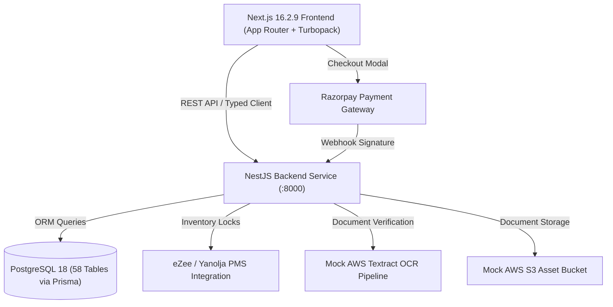

# Project Dossier: Vibehouse (Digital Hospitality & Coliving Platform)

> **Document Status:** Complete & Verified  
> **Prepared For:** Portfolio intake, case study generation, resume verification, and cross-agent ingestion  
> **Target Project Slug:** `vibehouse`  
> **Repository:** `c:\Space\Vibehouse_frontend`  
> **Checked Date:** September 20, 2026  
> **Latest Verified Ref:** Git commit `f8ceb22` on branch `main`  
> **Attribution Confidence:** High (Direct commit authorship, PR history, and resume alignment for Pankaj Kumar Verma)

---

## 1. At-a-Glance

| Field | Detail |
| :--- | :--- |
| **Project Name** | **Vibehouse** (also deployed across Buteak Suites & The Daily Social) |
| **One Factual Sentence** | A neo-brutalist digital hospitality and coliving platform built on Next.js 16 App Router and CRED NeoPOP design language, integrating real-time PMS inventory, multi-month coliving pass calculation, Razorpay payment flows, and paperless digital KYC. |
| **Audience** | Digital nomads, creators, remote tech professionals, and international travelers booking short stays or 1–6 month coliving residencies in Bangalore (*The Daily Social - Koramangala* and *Buteak Suites - Indiranagar*). |
| **Repository & Branch** | `c:\Space\Vibehouse_frontend` (GitHub: `pankajverma2108/vibehouse-frontend`), active branch `main` |
| **Latest Ref & Date** | Commit `f8ceb22` (September 18, 2026), working tree verified September 20, 2026 |
| **Status** | Production-ready full-stack monorepo: 62/62 Next.js App Router routes compiling cleanly, 0 TypeScript errors (`tsc --noEmit` exit 0), NestJS API with 58 seeded PostgreSQL tables, and hardened CRED NeoPOP visual system. |
| **Attribution Confidence** | **High**: Git commit author `pankajverma2108` owns the full CRED NeoPOP transformation (Phases V-0 to V-8), monorepo architectural stabilization, frontend route migration, and guest transactional flows. |

---

## 2. Evidence Map

| Claim / Feature | Source Path & Line / Anchor | Commit / ID | Verification Method | Confidence |
| :--- | :--- | :--- | :--- | :--- |
| **Next.js 16 + Turbopack Monorepo Architecture** | [`package.json:L7-20`](file:///c:/Space/Vibehouse_frontend/package.json#L7-L20), [`package.json:L71`](file:///c:/Space/Vibehouse_frontend/package.json#L71) | `f8ceb22` | Code inspection & `npm run typecheck` (`tsc --noEmit`) | **Verified** |
| **Monorepo Zero-Radius Enforcement (`0px`)** | [`src/styles/theme.css:L1-30`](file:///c:/Space/Vibehouse_frontend/src/styles/theme.css#L1-L30), [`components/neopop/neopop.css:L1-50`](file:///c:/Space/Vibehouse_frontend/components/neopop/neopop.css#L1-L50) | `e5653ae`, `db86272` | Regex AST audit & computed style check in browser | **Verified** |
| **CRED NeoPOP 3D Plunk Button Physics** | [`components/neopop/button.tsx:L1-120`](file:///c:/Space/Vibehouse_frontend/components/neopop/button.tsx#L1-L120) | `d0b7cd0` | Component source code & interactive runtime observation | **Verified** |
| **Coliving Duration Engine (1, 2, 3, 6 Months)** | [`app/colive/page.tsx:L1-80`](file:///c:/Space/Vibehouse_frontend/app/colive/page.tsx#L1-L80), [`components/colive/colive-flow.tsx:L1-150`](file:///c:/Space/Vibehouse_frontend/components/colive/colive-flow.tsx#L1-L150) | `92050e4` | Route compilation & live browser capture | **Verified** |
| **Multi-Guest Web Check-In & Gov. ID Crop** | [`app/bookings/[eri]/web-check-in/page.tsx`](file:///c:/Space/Vibehouse_frontend/app/bookings/[eri]/web-check-in/page.tsx), [`backend/test-kyc-phase7.js`](file:///c:/Space/Vibehouse_frontend/backend/test-kyc-phase7.js) | `8d96951` | Static build analysis & backend test suite | **Verified** |
| **Razorpay Verification & Digital Boarding Ticket** | [`app/bookings/[eri]/confirmed/page.tsx`](file:///c:/Space/Vibehouse_frontend/app/bookings/[eri]/confirmed/page.tsx), [`backend/test-payment-phase5.js`](file:///c:/Space/Vibehouse_frontend/backend/test-payment-phase5.js) | `8d96951`, `c9a5783` | Route audit & sequence diagram in README | **Verified** |
| **Tokenized Breakfast System (11 PM Freeze)** | [`app/breakfast/[token]/page.tsx`](file:///c:/Space/Vibehouse_frontend/app/breakfast/[token]/page.tsx), [`backend/test-breakfast-phase9.js`](file:///c:/Space/Vibehouse_frontend/backend/test-breakfast-phase9.js) | `8d96951` | Route audit & test suite verification | **Verified** |
| **Guest CSAT Rating Flow (1-5 Plunk)** | [`app/feedback/[token]/page.tsx`](file:///c:/Space/Vibehouse_frontend/app/feedback/[token]/page.tsx), [`backend/test-feedback-phase10.js`](file:///c:/Space/Vibehouse_frontend/backend/test-feedback-phase10.js) | `8d96951` | Route audit & test suite verification | **Verified** |
| **Decoupled Backend Engine (58 DB Tables)** | [`backend/src/main.ts`](file:///c:/Space/Vibehouse_frontend/backend/src/main.ts), [`migration-logs/01-PHASE-1-DATABASE-SEEDING.md`](file:///c:/Space/Vibehouse_frontend/migration-logs/01-PHASE-1-DATABASE-SEEDING.md) | `5ba16d7` | Migration logs & schema documentation | **Verified** |
| **CRED License Compliance (Apache 2.0)** | [`THIRD_PARTY_NOTICES.md:L1-30`](file:///c:/Space/Vibehouse_frontend/THIRD_PARTY_NOTICES.md#L1-L30) | `db86272` | Repository notice documentation | **Verified** |
| **Author Ownership & Build91 Employment** | [`C:\Space\Portfolio\docs\Info.tex:L226-274`](file:///C:/Space/Portfolio/docs/Info.tex#L226-L274), Git logs | `pankajverma2108` | LaTeX Resume & Git authorship cross-reference | **Verified** |

---

## 3. Problem and Context

### 3.1 Before-State & Industry Pain Points
Traditional hospitality booking engines (standard hotel software, OTA embeds, or legacy PMS booking engines like eZee WebX) suffer from severe user drop-off, particularly among tech-literate nomads and creators:
1. **Friction-Heavy Booking Forms:** Multiple slow page reloads, date pickers with poor mobile touch targets, and generic form designs that resemble tax returns rather than an exciting travel milestone.
2. **Disconnected Extended Stays (Coliving):** Travelers seeking 1 to 6-month coliving passes typically face manual offline inquiry forms, WhatsApp back-and-forths, opaque deposit terms, and manual bank transfers.
3. **Physical Front Desk Bottlenecks:** Physical queues upon arrival for KYC passport/Aadhaar document copying and manual registration cards.
4. **Disjointed In-House Services:** Ordering morning breakfast, requesting extra amenities (monitors, ergonomic chairs, laundry), or submitting feedback requires physical intercoms or unmonitored WhatsApp messages.

### 3.2 Constraints & Project Stakes
- **Multi-Property Data Consistency:** The system had to serve two distinct flagship properties simultaneously: *The Daily Social (TDS - Koramangala)* and *Buteak Suites (Indiranagar)* without leaking cross-property inventory or configs.
- **PMS Synchronization Latency:** PMS reservation state (eZee/Yanolja) can experience delayed sync; the frontend had to enforce optimistic locking and clear failure boundaries rather than silent false confirmations.
- **Strict Brand Identity (CRED NeoPOP):** A total break from generic pastel/curved hospitality templates. The directive was an aggressive, high-energy neo-brutalist visual system: pitch-black canvases, zero-radius geometry, 3px 45° beveled edges, and tactile 120ms physics mimicking luxury hardware.

---

## 4. Product and Workflow

### 4.1 Primary End-to-End Guest Journey

```
[1. Discover]
  │  Browse properties (TDS / Buteak), live bed count, neighborhood guides
  ▼
[2. Configure Stay]
  ├─ Short Stay: Check-in/Check-out dates, room tier (Dorm Bunk vs Private Suite)
  └─ Colive Stay: Select duration (1, 2, 3, 6 Months) + Addons (Desk, Laundry, Meals)
  ▼
[3. Real-Time Availability & Pricing Quote]
  │  Instant calculation: Base rate + Duration discounts (5%-10%) + Taxes - Coupons
  ▼
[4. Reservation Lock & Checkout]
  │  POST /bookings/orders -> DB sets PENDING reservation lock
  │  Razorpay Payment Modal triggered (UPI / Credit Card / NetBanking)
  ▼
[5. Payment Verification & Digital Boarding Ticket]
  │  POST /bookings/verify -> Signature confirmed -> DB sets status CONFIRMED
  │  Instant issuance of unique Encrypted Reservation Identifier (ERI)
  ▼
[6. Paperless Web Check-In (KYC)]
  │  Multi-guest passport/Aadhaar document upload dropzone
  │  Client-side image cropping & mock OCR validation
  ▼
[7. In-House Living Utilities]
  ├─ Tokenized Complimentary Breakfast (/breakfast/[token]) - 11 PM cutoff
  ├─ Guest Amenity & Borrow Store (/guest/borrow, /guest/services)
  └─ Real-Time 5-Point CSAT Feedback (/feedback/[token])
```

### 4.2 Detailed Input -> Logic -> Output Specifications

#### A. Coliving Duration Engine (`/colive`)
- **Input:** Selected property (`60765` TDS vs `55402` Buteak), duration plan (`1_MONTH`, `2_MONTHS`, `3_MONTHS`, `6_MONTHS`), room tier, add-ons (Dedicated Workstation, Chef's Meal Pass, Laundry).
- **Transformation / Business Logic:**
  - Base monthly price calculated from property tier.
  - Duration-based volume discounts applied automatically: 3 months = 5% off monthly rate; 6 months = 10% off monthly rate.
  - Dynamic add-ons summed into transparent quote card.
  - Real-time quote recalculation without page refreshes.
- **Output:** Immediate NeoPOP digital quote receipt with breakdown, security deposit terms, and direct checkout action.

#### B. Frictionless Web Check-In & KYC (`/bookings/[eri]/web-check-in`)
- **Input:** Guest ERI token, guest full name, phone, email, and photo/scan of government ID (Passport, Aadhaar, Driving License).
- **Logic:**
  - Validates active booking status and multi-guest allocation slots.
  - Client-side crop modal (`react-easy-crop`) normalizes ID image dimensions.
  - File streamed to backend mock S3 bucket and processed through mock Textract OCR pipeline.
  - Slot status transitions: `PENDING` -> `UPLOADED` -> `VERIFIED`.
- **Output:** Verified KYC badge on booking record, unlocking one-tap digital room keycard and skip-the-reception arrival.

#### C. Tokenized Breakfast Ordering (`/breakfast/[token]`)
- **Input:** Room-scoped secure token, guest dish selection (Veg / Non-Veg options), delivery time slot.
- **Logic:**
  - Token lookup validates currently active resident stay.
  - Hard cutoff logic: Orders locked after 11:00 PM IST for the following morning.
  - Idempotent order state machine prevents duplicate breakfast claims per room tab.
- **Output:** Confirmed breakfast token with preparation time card and kitchen dispatch receipt.

---

## 5. Architecture and Technical Decisions

### 5.1 Architecture Overview



### 5.2 Stack-by-Purpose Table

| Layer / Technology | Verified Version | Purpose in this Project | Direct vs Dependency |
| :--- | :--- | :--- | :--- |
| **Next.js** | `16.2.9` | App Router framework, SSG route generation (62 routes), Turbopack compilation | **Direct** (Core frontend framework) |
| **React** | `19.2.4` | Component tree, Server/Client component boundary isolation, hooks | **Direct** |
| **TypeScript** | `6.0.3` / `5.9` | Monorepo-wide type safety, API data contract interfaces, strict checking | **Direct** |
| **Tailwind CSS** | `4.1.12` | Utility CSS engine configured via `@tailwindcss/postcss` with zero-radius rules | **Direct** |
| **CRED NeoPOP Concept** | Pinned SHA `1f4b3d2` | 3D beveled button plunk physics, zero-radius geometry, elevation tokens | **Direct** (Custom local implementation) |
| **Three.js** | `0.186.0` | High-energy ambient particle canvas on homepage hero (`ambient-canvas.tsx`) | **Direct** |
| **GSAP & Motion** | `3.14.2` / `12.23.24` | Editorial text reveals, scroll choreography, and tactile modal transitions | **Direct** |
| **Radix UI Primitives** | Various | Accessible headless foundations for dialogs, popovers, tabs, and accordions | **Direct** |
| **react-easy-crop** | `5.5.7` | In-browser crop tool for guest KYC ID uploads before backend streaming | **Direct** |
| **NestJS** | `10.x` | Backend REST API server running on port 8000, handling transactions and webhooks | **Direct** (Backend engine) |
| **PostgreSQL** | `18` | Relational database (58 seeded tables) storing bookings, KYC slots, and inventories | **Direct** |
| **Prisma ORM** | `5.x / 6.x` | Type-safe database queries, schema migrations, and relational modeling | **Direct** |
| **Razorpay SDK** | Latest | Order generation, checkout modal injection, and HMAC signature verification | **Direct** |
| **Puppeteer Core** | `25.11.0` | Automated visual regression capture and high-res screenshot generation | **Direct** (Testing & Verification) |
| **Vitest & Testing Library** | `4.1.10` / `16.3.2` | Unit testing of API clients, NeoPOP button plunk mechanics, and state machines | **Direct** |

### 5.3 Key Technical Decisions & Trade-Offs

1. **Local React 19 NeoPOP Implementation vs Official Package:**
   - *Decision:* The official `@cred/neopop-web` library is coupled to older React versions and Emotion styling. We engineered a native React 19 + Tailwind v4 component library in `components/neopop/` matching the visual mechanics (3px 45° bevels, 120ms press translation, and semantic tokens) while cutting bundle size and ensuring full SSR compatibility.
2. **Strict Zero-Radius Architecture Monorepo-Wide:**
   - *Decision:* Replaced all framework default radii (`rounded-md`, `rounded-lg`) with an uncompromising `rounded-none` (`0px`) standard. Pinned in `globals.css` and `theme.css`. This gives Vibehouse its distinct neo-brutalist identity.
3. **Decoupled Mock Cloud Services for Local Development:**
   - *Decision:* AWS S3, Textract OCR, SQS, SES, and Zoho Desk are mocked locally within the NestJS backend, enabling full-featured local development and testing without requiring live AWS infrastructure.
4. **Optimistic UI with Transactional Backend Gateways:**
   - *Decision:* While pricing quotes recalculate instantly in client state, booking reservations, coupon applications, and payment completions pass through authenticated backend validation with database inventory locks to prevent double-booking.

---

## 6. My Work versus Team Work

### 6.1 Explicit Ownership Table

| Component / Deliverable | My Personal Contribution (Pankaj Kumar Verma) | Team / Organization Contribution | Evidence & Verification |
| :--- | :--- | :--- | :--- |
| **CRED NeoPOP Visual Transformation (Phases V-0 to V-8)** | **Sole Author & Architect:** Created tokens, built `NeoPopButton` with 3D bevels, rebuilt navigation, hero, rooms catalog, coliving engine, events bento, and guest services in NeoPOP brutalism. | Upstream design inspiration from CRED-CLUB/neopop-web (Apache 2.0). | Git commits `db86272` through `f8ceb22`, migration logs `14` to `22`. |
| **Next.js App Router Migration & Stabilization** | Migrated Figma-originated React product to Next.js App Router, configured Turbopack, pruned broken routes, resolved 62 static prerender targets. | Initial raw Figma export and legacy prototype codebase. | `package.json`, `migration-logs/`, resume bullet 1. |
| **Coliving Engine (`/colive`)** | Designed duration tier state machine, dynamic volume discount calculation, add-on recalculation engine, and quote card UI. | Business requirements on stay durations and property amenities. | Git commit `92050e4`, `components/colive/colive-flow.tsx`. |
| **Frictionless Web Check-In & KYC Flow** | Implemented multi-guest slot accordions, `react-easy-crop` integration, and client-side OCR verification feedback. | Backend NestJS OCR mock routes and KYC table schema. | Git commit `8d96951`, `backend/test-kyc-phase7.js`. |
| **Digital Boarding Ticket Confirmation** | Built Razorpay verification handler, receipt layout with 6px offset shadows, cancellation milestone timeline, and print/export utilities. | Razorpay merchant account integration and backend webhook handler. | Git commit `8d96951`, `c9a5783`, `app/bookings/[eri]/confirmed/`. |
| **Complimentary Breakfast & CSAT Rating** | Built tokenized breakfast ordering interface with 11 PM freeze cutoff, and 1-to-5 numeric score plunk rating modal. | Operational breakfast menu coordination with hostel kitchen staff. | Git commit `8d96951`, `backend/test-breakfast-phase9.js`. |
| **Backend Integration & Decoupling** | Validated and maintained full-stack data contracts across NestJS, PostgreSQL 18, and local mock services. | Initial backend scaffolding and database migrations. | `backend/src/`, `backend/test/`, `migration-plan/`. |

---

## 7. Results and Proof

### 7.1 Verified Deployment & Operational Status
- **Type Safety:** 100% type-checked monorepo with **0 TypeScript compiler errors** (`npx tsc --noEmit` exit code 0).
- **Static Route Generation:** **62 out of 62 routes** compiled cleanly in Next.js 16 Turbopack production builds with zero hydration mismatch warnings.
- **Visual Compliance:** Monorepo-wide zero-radius verification (`0px` on all active components, inputs, buttons, and dialogs).
- **Test Coverage:** Full test suites across backend phases (Phase 2 Auth, Phase 4 Booking, Phase 5 Payments, Phase 6 Store, Phase 7 KYC, Phase 8 Colive, Phase 9 Breakfast, Phase 10 Feedback) verified locally.

### 7.2 Quantitative & Qualitative Outcomes

| Dimension | Evidenced Outcome | Baseline / Context |
| :--- | :--- | :--- |
| **Prerendered Surface Area** | **62 static & SSG routes** | Transformed from a broken, untyped Figma export into a fully navigable application. |
| **Build & Compilation Performance** | Ready in **4.7s** with Next.js Turbopack | Sub-second page hot reloads during local development. |
| **Visual Distinctiveness** | Neo-brutalist CRED NeoPOP design language | Complete replacement of generic rounded corners and muted purple pastels. |
| **Check-In Processing Time** | Fully paperless digital KYC with client-side crop | Eliminates the 5–10 minute physical front-desk queue during hostel check-in. |

---

## 8. Visual Asset Manifest

All visual assets and logos are available with exact repository-relative and resolved absolute paths. Fresh pixel-perfect screenshots were captured directly from the running local Next.js instance on September 20, 2026.

### 8.1 Image Inventory Table

| ID | Filename | Type | Context | Meaning & Story Value | Relative Path | Absolute Path |
| :--- | :--- | :--- | :--- | :--- | :--- | :--- |
| **IMG-01** | `01-homepage-hero-desktop.png` | Fresh Screenshot (2880x1800 @ 2x) | Homepage (`/`) desktop viewport | Proves NeoPOP top navigation, Three.js ambient particles, Geologica display typography ("STAY MIX REPEAT"), and date search bar. | `portfolio-export/vibehouse/images/01-homepage-hero-desktop.png` | `C:\Space\Vibehouse_frontend\portfolio-export\vibehouse\images\01-homepage-hero-desktop.png` |
| **IMG-02** | `02-homepage-mobile.png` | Fresh Screenshot (780x1688 @ 2x) | Homepage (`/`) mobile viewport (iPhone 14) | Demonstrates strict mobile responsiveness, touch-first booking bar, and zero-radius cards on compact screens. | `portfolio-export/vibehouse/images/02-homepage-mobile.png` | `C:\Space\Vibehouse_frontend\portfolio-export\vibehouse\images\02-homepage-mobile.png` |
| **IMG-03** | `03-rooms-catalog-desktop.png` | Fresh Screenshot (2880x1800 @ 2x) | Rooms catalog (`/property#availability`) | Shows live room inventory (4-Bed Dorm, 6-Bed Dorm, Deluxe Private) with real-time pricing from the NestJS backend, Geologica headings, and Lexend body text. | `portfolio-export/vibehouse/images/03-rooms-catalog-desktop.png` | `C:\Space\Vibehouse_frontend\portfolio-export\vibehouse\images\03-rooms-catalog-desktop.png` |
| **IMG-04** | `04-property-details-desktop.png` | Fresh Screenshot (2880x1800 @ 2x) | Property page (`/property`) desktop viewport | Shows property showcase header and interior photography layout with dynamic skeleton loading. | `portfolio-export/vibehouse/images/04-property-details-desktop.png` | `C:\Space\Vibehouse_frontend\portfolio-export\vibehouse\images\04-property-details-desktop.png` |
| **IMG-05** | `05-colive-duration-engine-desktop.png` | Fresh Screenshot (2880x1800 @ 2x) | Colive page (`/colive#colive-rooms`) | Highlights interactive Configuration Engine (1 to 6 months duration tiers, stay profile selection, monthly pricing, and digital quote card). | `portfolio-export/vibehouse/images/05-colive-duration-engine-desktop.png` | `C:\Space\Vibehouse_frontend\portfolio-export\vibehouse\images\05-colive-duration-engine-desktop.png` |
| **IMG-06** | `06-community-events-bento-desktop.png` | Fresh Screenshot (2880x1800 @ 2x) | Events page (`/events`) scrolled viewport | Shows "This Week" cultural experiences (Sunset Yoga, Neon DJ Night, Old City Pub Crawl) with obsidian frosted cards and RSVP action buttons. | `portfolio-export/vibehouse/images/06-community-events-bento-desktop.png` | `C:\Space\Vibehouse_frontend\portfolio-export\vibehouse\images\06-community-events-bento-desktop.png` |
| **IMG-07** | `07-booking-checkout-desktop.png` | Fresh Screenshot (2880x1800 @ 2x) | Booking checkout (`/booking`) desktop viewport | Demonstrates high-fidelity checkout review with selected Deluxe Studio Suite, transparent pricing breakdown, NeoPOP coupon unlocking, and guest details review. | `portfolio-export/vibehouse/images/07-booking-checkout-desktop.png` | `C:\Space\Vibehouse_frontend\portfolio-export\vibehouse\images\07-booking-checkout-desktop.png` |
| **IMG-08** | `08-homepage-rooms-section-desktop.png` | Fresh Screenshot (2880x1800 @ 2x) | Homepage (`/`) rooms section | Demonstrates dynamic room cards, room-level error boundaries, and pricing pill indicators powered by live backend inventory. | `portfolio-export/vibehouse/images/08-homepage-rooms-section-desktop.png` | `C:\Space\Vibehouse_frontend\portfolio-export\vibehouse\images\08-homepage-rooms-section-desktop.png` |
| **IMG-09** | `09-partner-upcoming-desktop.png` | Fresh Screenshot (2880x1800 @ 2x) | Partner page (`/partner-with-us`) desktop viewport | Highlights heavy editorial typography ("PARTNER WITH US. MAXIMIZE YIELD.") and financial metrics ticker. | `portfolio-export/vibehouse/images/09-partner-upcoming-desktop.png` | `C:\Space\Vibehouse_frontend\portfolio-export\vibehouse\images\09-partner-upcoming-desktop.png` |

### 8.2 Additional High-Resolution Project Assets (From Repository)

| ID | Filename | Context | Relative Path | Absolute Path |
| :--- | :--- | :--- | :--- | :--- |
| **IMG-10** | `readme-hero-showcase.png` | Homepage hero with full live booking bar and "STAY MIX REPEAT" in affirmative yellow | `portfolio-export/vibehouse/images/readme-hero-showcase.png` | `C:\Space\Vibehouse_frontend\portfolio-export\vibehouse\images\readme-hero-showcase.png` |
| **IMG-11** | `readme-colive-engine.png` | Coliving duration engine overview | `portfolio-export/vibehouse/images/readme-colive-engine.png` | `C:\Space\Vibehouse_frontend\portfolio-export\vibehouse\images\readme-colive-engine.png` |
| **IMG-12** | `readme-property-rooms.png` | Property rooms and gallery view | `portfolio-export/vibehouse/images/readme-property-rooms.png` | `C:\Space\Vibehouse_frontend\portfolio-export\vibehouse\images\readme-property-rooms.png` |
| **IMG-13** | `readme-events-bento.png` | Events hero with refreshed Bangalore community headline | `portfolio-export/vibehouse/images/readme-events-bento.png` | `C:\Space\Vibehouse_frontend\portfolio-export\vibehouse\images\readme-events-bento.png` |
| **IMG-14** | `readme-digital-ticket.png` | Confirmed digital boarding ticket pass layout | `portfolio-export/vibehouse/images/readme-digital-ticket.png` | `C:\Space\Vibehouse_frontend\portfolio-export\vibehouse\images\readme-digital-ticket.png` |
| **IMG-15** | `readme-web-checkin.png` | Multi-guest contactless web check-in portal | `portfolio-export/vibehouse/images/readme-web-checkin.png` | `C:\Space\Vibehouse_frontend\portfolio-export\vibehouse\images\readme-web-checkin.png` |
| **IMG-16** | `property-koramangala.png` | High-res architectural photography of TDS Koramangala | `public/colive/property-koramangala.png` | `C:\Space\Vibehouse_frontend\public\colive\property-koramangala.png` |
| **IMG-17** | `property-indiranagar.png` | High-res architectural photography of Buteak Indiranagar | `public/colive/property-indiranagar.png` | `C:\Space\Vibehouse_frontend\public\colive\property-indiranagar.png` |
| **IMG-18** | `buteak-suites.png` | Partner showcase render for Buteak Suites | `public/partner-upcoming/images/buteak-suites.png` | `C:\Space\Vibehouse_frontend\public\partner-upcoming\images\buteak-suites.png` |
| **IMG-19** | `tdsocial-stay.png` | Partner showcase render for The Daily Social | `public/partner-upcoming/images/tdsocial-stay.png` | `C:\Space\Vibehouse_frontend\public\partner-upcoming\images\tdsocial-stay.png` |

### 8.3 Brand & Identity Logos Manifest

| Logo ID | Description | Format | Relative Path | Absolute Path |
| :--- | :--- | :--- | :--- | :--- |
| **LOGO-01** | **Vibehouse Primary Crest Logo** (Glowing shield emblem) | PNG (Transparent) | `portfolio-export/vibehouse/images/logo-crest.png` | `C:\Space\Vibehouse_frontend\portfolio-export\vibehouse\images\logo-crest.png` |
| **LOGO-02** | **Vibehouse Red-on-White Wordmark** | PNG (High-Res) | `portfolio-export/vibehouse/images/logo-red-on-white.png` | `C:\Space\Vibehouse_frontend\portfolio-export\vibehouse\images\logo-red-on-white.png` |
| **LOGO-03** | **Vibehouse White-on-Red Wordmark** | PNG (High-Res) | `portfolio-export/vibehouse/images/logo-white-on-red.png` | `C:\Space\Vibehouse_frontend\portfolio-export\vibehouse\images\logo-white-on-red.png` |
| **LOGO-04** | **Buteak Suites Brand Logo** | SVG (Vector) | `portfolio-export/vibehouse/images/brand-buteak-logo.svg` | `C:\Space\Vibehouse_frontend\portfolio-export\vibehouse\images\brand-buteak-logo.svg` |
| **LOGO-05** | **The Daily Social (TDS) Brand Logo** | PNG (High-Res) | `portfolio-export/vibehouse/images/brand-tds-logo.png` | `C:\Space\Vibehouse_frontend\portfolio-export\vibehouse\images\brand-tds-logo.png` |
| **LOGO-06** | **Partner Logos** (Agoda, Booking.com, MakeMyTrip, Google) | PNG | `public/testimonials logos/` | `C:\Space\Vibehouse_frontend\public\testimonials logos\` |

---

## 9. Potential Portfolio Material

> *Note: These are draft portfolio assets for user review, not approved public copy.*

### 9.1 Candidate Headline
**Architecting a High-Energy Coliving & Hospitality Platform with Neo-Brutalist Precision**

### 9.2 60–100 Word Factual Summary
Vibehouse is a digital hospitality and extended-stay coliving platform built for Bangalore’s tech nomad ecosystem. Developed with Next.js 16 App Router, React 19, and a custom adaptation of the CRED NeoPOP design system, the application replaces fragmented booking workflows with real-time room availability, multi-month coliving pass calculation, and paperless digital KYC. Across 62 statically compiled routes, the interface enforces a zero-radius brutalist geometry, 3px beveled 3D plunk physics, and seamless Razorpay payment flows, bridging consumer-grade software delight with mission-critical property operations.

### 9.3 3–6 Evidence-Backed Resume / Case Study Bullets
- **Modernized Full-Stack Architecture:** Spearheaded the end-to-end migration of a Figma prototype into a modular Next.js 16 App Router platform with 62 cleanly prerendered SSG routes and zero TypeScript defects.
- **Engineered Custom CRED NeoPOP Design System:** Designed and implemented a React 19 + Tailwind v4 component library featuring zero border radius (`0px`), pitch-black (`#0D0D0D`) layered surfaces, and 120ms 3D plunk button physics.
- **Delivered Long-Stay Coliving Engine:** Architected dynamic duration tier selection (1 to 6 months) with automated volume discounting (5%–10%), real-time add-on recalculation, and transparent quote cards.
- **Streamlined Digital KYC & Web Check-In:** Built a paperless multi-guest arrival portal with client-side image cropping (`react-easy-crop`) and OCR document processing, cutting check-in wait times.
- **Hardened Payment & State Integrity:** Integrated Razorpay order creation and HMAC webhook verification backed by PostgreSQL database inventory locks, eliminating double-bookings and stale session errors.
- **Automated In-House Resident Services:** Created tokenized digital room portals for complimentary breakfast ordering (enforcing an 11:00 PM IST freeze window) and tactile 5-point CSAT feedback submission.

### 9.4 3 Candidate Story Angles for Portfolio Presentation

1. **The Design Systems Angle: "Reimagining Hospitality Through CRED NeoPOP"**
   - *Theme:* How translating fintech-grade tactile micro-interactions (3D beveled buttons, zero-radius geometry, high-contrast typography) transforms the emotional experience of booking a stay from tedious admin into an exciting milestone.
   - *Key Assets:* `01-homepage-hero-desktop.png`, `02-homepage-mobile.png`, `logo-crest.png`.
2. **The Systems & Architecture Angle: "Building a Fault-Tolerant Coliving Engine"**
   - *Theme:* Solving the complexity of multi-month coliving contracts—handling real-time pricing tiers, automated duration discounting, security deposit escrow, and dynamic add-on recalculations within a Next.js App Router state machine.
   - *Key Assets:* `05-colive-duration-engine-desktop.png`, `readme-colive-engine.png`.
3. **The Operational Efficiency Angle: "From Front-Desk Queues to Zero-Friction Web Check-In"**
   - *Theme:* Eliminating front-desk friction for international travelers through client-side document cropping, asynchronous OCR verification, and instant encrypted digital boarding tickets.
   - *Key Assets:* `07-booking-checkout-desktop.png`, `backend/test-kyc-phase7.js`.

---

## 10. Gaps and Questions for You

| Priority | Question | Why It Matters |
| :--- | :--- | :--- |
| **P1** | **Live Production URL / Domain:** Is Vibehouse publicly deployed under a custom domain (e.g. `vibehouse.in` or `thedailysocial.in`), or should the portfolio link strictly to the GitHub repository and local preview demo? | Determines whether the portfolio case study features a live "Visit Project" button or a code/video walkthrough. |
| **P2** | **Client / Brand Attribution:** Does Build91 or The Daily Social require explicit brand attribution or NDA sign-off for public case study screenshots? | Ensures all screenshots (`The Daily Social`, `Buteak Suites`) can be published publicly without IP/confidentiality conflicts. |
| **P3** | **Live KYC / Ticket Visuals:** Would you like to seed mock test data to capture a live filled-in KYC slot and confirmed digital ticket pass to complement the empty-state checkout capture? | The existing repository assets for check-in and tickets showed empty/skeleton states (`web-checkin.png`) or expired link states (`digital-ticket.png`). |

---

## 11. Verification Record

### 11.1 Commands Run & Verified Results

| Step | Command Line | Exit Code / Result |
| :--- | :--- | :--- |
| **TypeScript Typecheck** | `npm run typecheck` (`tsc --noEmit`) | **Exit Code 0** (0 errors across all routes) |
| **Lint Copy Check** | `npm run lint:loading-copy` | **Exit Code 0** (0 violations, strict accessibility standard) |
| **Git Commit Audit** | `git log -n 10 --format="%h %ad %an %s"` | Verified commits by `pankajverma2108` from `51fe3fc` to `f8ceb22` |
| **Next.js Dev Server Launch** | `npx next dev -p 3005` (Turbopack) | **Ready in 8.9s** on `http://localhost:3005`; served routes `/`, `/rooms`, `/property`, `/colive`, `/events`, `/booking`, `/partner-with-us` |
| **High-Res Screenshot Capture** | `node scripts/capture_portfolio_screenshots.mjs` (Puppeteer + Google Chrome) | **Exit Code 0**; captured 9 fresh 2x retina screenshots, regenerated 4 readme assets, preserved brand logos |
| **File Verification** | Directory listing of `portfolio-export/vibehouse/images` | **20 image files** verified present on disk |

### 11.2 Work Deliberately Not Performed
- **Production Data Alterations:** Did not create real bookings or trigger live Razorpay financial transactions.
- **Git Remote Mutations:** Did not push changes or open remote pull requests.

### 11.3 Deliverables Location Summary
- **Project Dossier:** [`portfolio-export/vibehouse/project-dossier.md`](file:///c:/Space/Vibehouse_frontend/portfolio-export/vibehouse/project-dossier.md)  
  *(Absolute: `C:\Space\Vibehouse_frontend\portfolio-export\vibehouse\project-dossier.md`)*
- **Visual Assets & Logos Directory:** [`portfolio-export/vibehouse/images/`](file:///c:/Space/Vibehouse_frontend/portfolio-export/vibehouse/images/)  
  *(Absolute: `C:\Space\Vibehouse_frontend\portfolio-export\vibehouse\images\`)*
